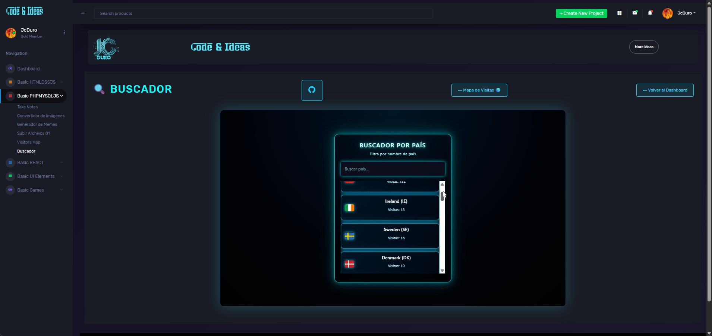

## 🗺️ Buscador de países por visitas

Buscador en tiempo real que muestra bandera, nombre y código ISO del país, junto con el número de visitas registradas en la tabla visitas_pais. Se integra como módulo dentro del dashboard JcDuro.

---​

## 📌 Descripción general

- Muestra una lista de países ordenados por cantidad de visitas.
- Cada país incluye: bandera (flag-icon-css), nombre, siglas (código ISO2) y total de visitas.
​
---

## ✨ Vista previa



---

## ✨ Pruevalo Online

[Busqueda](https://jcduro.bexartideas.com/proyectos/dashjc/buscador1/buscador1.php)

--- 

El usuario puede filtrar escribiendo parte del nombre del país o sus siglas.

##⚙️ Cómo funciona
- Flujo de datos
- Frontend (buscador1.php)
- Contiene el input de búsqueda y la lista donde se pintan los resultados (<ul id="result">).
- Aplica estilos neón y un contenedor con scroll para mostrar solo algunos ítems a la vez.
- Backend (get_visitas_map.php)
- Consulta la tabla visitas_pais usando PDO.
- Devuelve un JSON con la siguiente estructura:


 ```text
json
[
  { "code": "CO", "nombrePais": "Colombia", "value": 78 },
  { "code": "US", "nombrePais": "Estados Unidos", "value": 388 }
]
JavaScript
 ```
---

- Hace fetch a get_visitas_map.php.
- Recorre el array y crea dinámicamente <li> con la bandera, nombre, código y visitas.

## 🧠 Cómo funciona la búsqueda
- El input de búsqueda tiene id="filter" y escucha el evento input.
- Cada vez que el usuario escribe, se ejecuta filterData(term).
- La función recorre todos los <li> guardados en listItems y compara innerText del item con el término en minúsculas.
- Si el texto contiene el término, se mantiene visible; si no, se le añade la clase .hide para ocultarlo:


 ```text
js
function filterData(searchTerm) {
  const term = searchTerm.toLowerCase()

  listItems.forEach(item => {
    if (item.innerText.toLowerCase().includes(term)) {
      item.classList.remove('hide')
    } else {
      item.classList.add('hide')
    }
  })
}
 ```
---
- Esto permite filtrar por nombre (“Colombia”) o por código (“CO”) sin lógica adicional, porque ambos textos forman parte del contenido del <li>.
- Consulta la tabla visitas_pais.
- Expone el endpoint get_visitas_map.php que devuelve JSON.
- JavaScript (Vanilla)
- fetch al endpoint backend.
- Manipulación del DOM para generar la lista de países.
- Lógica de filtrado en tiempo real sobre los elementos de la lista.
​
---
​
## 📊 Lenguajes y Herramientas

[](https://skillicons.dev)

---


MySQL

Base de datos con la tabla:

 ```text
sql
CREATE TABLE visitas_pais (
  id            INT(11)      NOT NULL,
  iso_pais      CHAR(2)      NOT NULL,
  pais          VARCHAR(100) NOT NULL,
  visitas       INT(11)      NOT NULL DEFAULT 0,
  ultima_visita DATETIME     NOT NULL
);

 ```
---

CSS

Estilos personalizados “neón azul” para el contenedor, input y lista.
Scroll personalizado sobre la lista (.neon-user-list) para limitar visualmente el número de elementos visibles.

# flag-icon.min.css
Biblioteca de iconos de banderas.
Se usa con clases del tipo flag-icon flag-icon-co donde co viene de code.toLowerCase().


## 📊 Resto del Codigo

[Codigo_Visitas_Map](https://github.com/jcduro/Mapa_Visitas_CSS_MYSQL_PHP_JVECTOR/)
​
